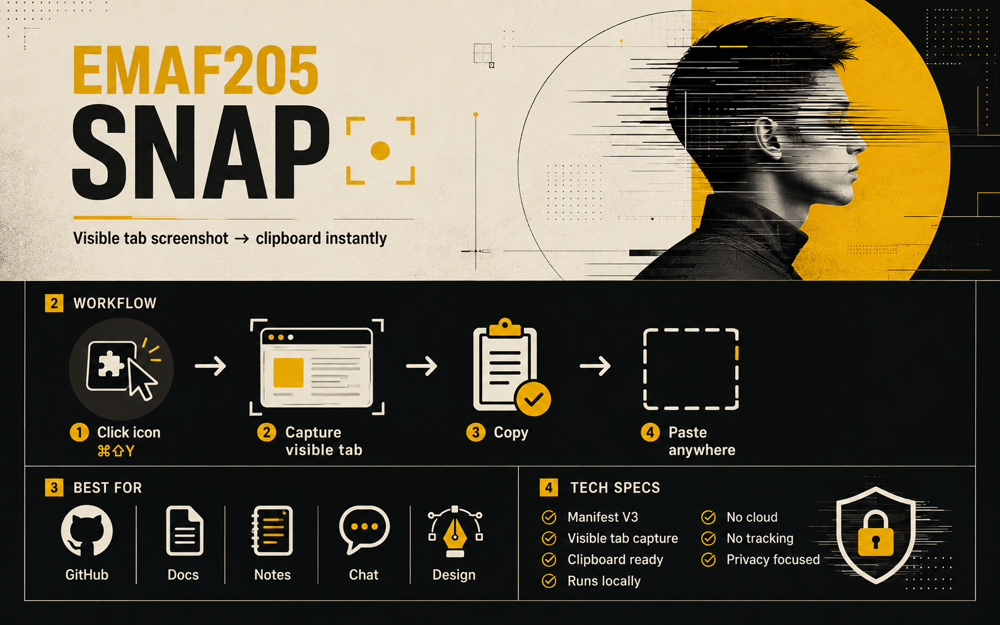

<p align="center">
  
</p>

# EMAF205 SNAP

**Capture the visible Chrome tab and copy it instantly to your clipboard as PNG.**

Click the extension icon or press **⌘⇧Y** on macOS (**Ctrl+Shift+Y** on Windows/Linux). EMAF205 SNAP captures exactly the visible area of the active tab, writes the screenshot to the system clipboard, shows a brief **✓ COPIED** confirmation, and closes automatically.

No save dialog. No upload. No extra step.

## How it works

1. **Trigger** — click the extension icon or use the keyboard shortcut.
2. **Capture** — Chrome captures the visible area of the active tab.
3. **Copy** — the PNG is written directly to the system clipboard.
4. **Paste** — use **⌘V / Ctrl+V** in any app that accepts pasted images.

## Features

- One-click visible-tab capture
- Keyboard shortcut support
- PNG copied directly to clipboard
- Fast **✓ COPIED** visual confirmation
- Red error state when capture/copy fails
- Manifest V3
- No server or cloud processing
- No analytics or tracking
- No `<all_urls>` host permission
- Runs locally in Chrome

## Install

### Option A — load the repository

1. Download or clone this repository.
2. Open `chrome://extensions`.
3. Enable **Developer mode**.
4. Click **Load unpacked**.
5. Select the repository folder containing `manifest.json`.

### Option B — use the packaged extension

Download `dist/EMAF205-SNAP-v1.2.0.zip`, extract it, then load the extracted folder through **Load unpacked** in `chrome://extensions`.

## Shortcut

| Platform | Default shortcut |
|---|---|
| macOS | `Command + Shift + Y` |
| Windows / Linux | `Ctrl + Shift + Y` |

If the shortcut conflicts with another extension or browser command, open:

```text
chrome://extensions/shortcuts
```

and assign another shortcut to **EMAF205 SNAP**.

## Visual confirmation

After a successful capture:

- a compact green **✓ COPIED** message appears for about 650 ms;
- the toolbar badge briefly shows **✓**;
- the popup closes automatically.

If something fails, the popup remains open with a red error message and the toolbar badge shows **!**.

## Permissions

EMAF205 SNAP intentionally keeps permissions minimal:

- `activeTab` — temporary access to the active tab after the user invokes the extension;
- `clipboardWrite` — writes the captured PNG to the system clipboard.

There are **no host permissions** and no `<all_urls>` access.

## Privacy

EMAF205 SNAP does not upload screenshots or send browsing data anywhere.

- No server
- No cloud storage
- No analytics
- No tracking
- No external network requests

The screenshot is captured by Chrome and copied locally to your clipboard.

## Project structure

```text
emaf205-snap/
├── manifest.json
├── capture.html
├── capture.js
├── icons/
│   ├── icon-16.png
│   ├── icon-32.png
│   ├── icon-48.png
│   └── icon-128.png
├── assets/
│   └── emaf205-snap-overview.png
├── docs/
│   └── TEST_REPORT.md
└── dist/
    └── EMAF205-SNAP-v1.2.0.zip
```

## Technical notes

- Manifest: **V3**
- Version: **1.2.0**
- Minimum Chrome version: **109**
- Capture API: `chrome.tabs.captureVisibleTab()`
- Output: **PNG in clipboard**
- Trigger: extension action or keyboard command

## Validation

Static validation and package checks are documented in [`docs/TEST_REPORT.md`](docs/TEST_REPORT.md).

A physical macOS shortcut/clipboard interaction cannot be reproduced in the Linux validation container, so final macOS acceptance remains: invoke → confirm **✓ COPIED** → paste into an image-capable destination.

---

**Made with ❤️ in Milan by EmaF205**
